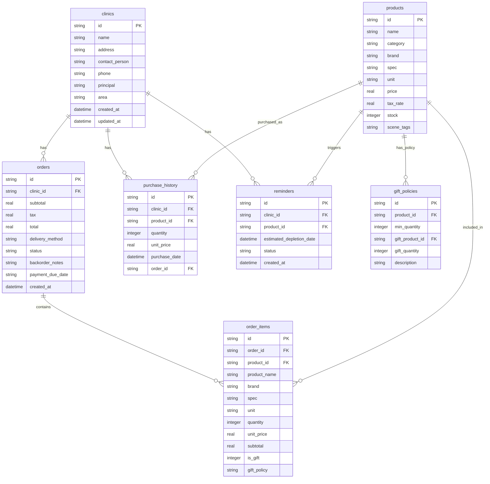

## 1. 架构设计

```mermaid
graph TB
    "前端 React+Vite" --> "API层 Express"
    "API层 Express" --> "数据层 SQLite"
    "前端 React+Vite" --> "本地状态 Zustand"
    "数据层 SQLite" --> "初始化种子数据"
```

采用前后端分离架构，前端 React + Vite 构建，后端 Express 提供 RESTful API，SQLite 作为轻量级嵌入式数据库，适合单机桌面端场景，无需额外部署数据库服务。

## 2. 技术说明

- **前端**：React@18 + TypeScript + Tailwind CSS@3 + Vite
- **初始化工具**：vite-init（react-express-ts 模板）
- **后端**：Express@4 + TypeScript（ESM 模式）
- **数据库**：SQLite（通过 better-sqlite3 驱动）
- **状态管理**：Zustand
- **路由**：react-router-dom@6
- **图标**：lucide-react

## 3. 路由定义

| 路由 | 用途 |
|------|------|
| / | 工作台首页，今日提醒和快捷操作 |
| /customers | 客户档案列表 |
| /customers/:id | 客户档案详情 |
| /order/new | 新建订单（病例场景选品） |
| /order/confirm/:id | 报价确认页 |
| /reminders | 回访提醒列表 |

## 4. API 定义

### 4.1 客户相关

```typescript
interface Clinic {
  id: string;
  name: string;
  address: string;
  contact_person: string;
  phone: string;
  principal: string;
  area: string;
  created_at: string;
  updated_at: string;
}

interface ClinicWithStats extends Clinic {
  last_purchase_date: string | null;
  outstanding_order_count: number;
}

// GET /api/clinics - 获取客户列表（支持搜索和筛选）
// GET /api/clinics/:id - 获取客户详情
// GET /api/clinics/:id/consumables - 获取客户常用耗材
// GET /api/clinics/:id/brands - 获取客户历史偏好品牌
// GET /api/clinics/:id/orders/outstanding - 获取客户未结清订单
```

### 4.2 耗材与品类

```typescript
interface Product {
  id: string;
  name: string;
  category: string;
  brand: string;
  spec: string;
  unit: string;
  price: number;
  tax_rate: number;
  stock: number;
  scene_tags: string[];
}

interface SceneRecommendation {
  scene: string;
  products: Product[];
}

// GET /api/products - 获取耗材列表（支持搜索和分类筛选）
// POST /api/products/recommend - 根据病例场景推荐品项
```

### 4.3 订单

```typescript
interface Order {
  id: string;
  clinic_id: string;
  items: OrderItem[];
  subtotal: number;
  tax: number;
  total: number;
  delivery_method: "logistics" | "local_delivery" | "self_pickup";
  status: "pending" | "partial" | "shipped" | "completed";
  backorder_notes: string;
  payment_due_date: string;
  created_at: string;
}

interface OrderItem {
  product_id: string;
  product_name: string;
  brand: string;
  spec: string;
  unit: string;
  quantity: number;
  unit_price: number;
  subtotal: number;
  is_gift: boolean;
  gift_policy: string | null;
}

// POST /api/orders - 创建订单
// GET /api/orders - 获取订单列表
// GET /api/orders/:id - 获取订单详情
// POST /api/orders/:id/confirm - 生成确认单文本
```

### 4.4 回访提醒

```typescript
interface Reminder {
  id: string;
  clinic_id: string;
  clinic_name: string;
  product_id: string;
  product_name: string;
  estimated_depletion_date: string;
  status: "pending" | "contacted" | "ordered" | "postponed";
  created_at: string;
}

// GET /api/reminders - 获取提醒列表
// PUT /api/reminders/:id - 更新提醒状态
// GET /api/reminders/today - 获取今日提醒
```

### 4.5 赠品政策

```typescript
interface GiftPolicy {
  id: string;
  product_id: string;
  min_quantity: number;
  gift_product_id: string;
  gift_product_name: string;
  gift_quantity: number;
  description: string;
}

// GET /api/gift-policies - 获取赠品政策列表
```

## 5. 服务端架构图

```mermaid
graph LR
    "Controller" --> "Service"
    "Service" --> "Repository"
    "Repository" --> "SQLite"
```

## 6. 数据模型

### 6.1 数据模型定义



### 6.2 数据定义语言

```sql
CREATE TABLE clinics (
  id TEXT PRIMARY KEY,
  name TEXT NOT NULL,
  address TEXT NOT NULL,
  contact_person TEXT NOT NULL,
  phone TEXT NOT NULL,
  principal TEXT NOT NULL,
  area TEXT NOT NULL,
  created_at TEXT DEFAULT (datetime('now')),
  updated_at TEXT DEFAULT (datetime('now'))
);

CREATE TABLE products (
  id TEXT PRIMARY KEY,
  name TEXT NOT NULL,
  category TEXT NOT NULL,
  brand TEXT NOT NULL,
  spec TEXT NOT NULL,
  unit TEXT NOT NULL,
  price REAL NOT NULL,
  tax_rate REAL NOT NULL DEFAULT 0.13,
  stock INTEGER NOT NULL DEFAULT 0,
  scene_tags TEXT NOT NULL DEFAULT '[]'
);

CREATE TABLE orders (
  id TEXT PRIMARY KEY,
  clinic_id TEXT NOT NULL REFERENCES clinics(id),
  subtotal REAL NOT NULL,
  tax REAL NOT NULL,
  total REAL NOT NULL,
  delivery_method TEXT NOT NULL CHECK(delivery_method IN ('logistics', 'local_delivery', 'self_pickup')),
  status TEXT NOT NULL DEFAULT 'pending' CHECK(status IN ('pending', 'partial', 'shipped', 'completed')),
  backorder_notes TEXT DEFAULT '',
  payment_due_date TEXT NOT NULL,
  created_at TEXT DEFAULT (datetime('now'))
);

CREATE TABLE order_items (
  id TEXT PRIMARY KEY,
  order_id TEXT NOT NULL REFERENCES orders(id),
  product_id TEXT NOT NULL REFERENCES products(id),
  product_name TEXT NOT NULL,
  brand TEXT NOT NULL,
  spec TEXT NOT NULL,
  unit TEXT NOT NULL,
  quantity INTEGER NOT NULL,
  unit_price REAL NOT NULL,
  subtotal REAL NOT NULL,
  is_gift INTEGER NOT NULL DEFAULT 0,
  gift_policy TEXT
);

CREATE TABLE purchase_history (
  id TEXT PRIMARY KEY,
  clinic_id TEXT NOT NULL REFERENCES clinics(id),
  product_id TEXT NOT NULL REFERENCES products(id),
  quantity INTEGER NOT NULL,
  unit_price REAL NOT NULL,
  purchase_date TEXT NOT NULL,
  order_id TEXT NOT NULL REFERENCES orders(id)
);

CREATE TABLE reminders (
  id TEXT PRIMARY KEY,
  clinic_id TEXT NOT NULL REFERENCES clinics(id),
  product_id TEXT NOT NULL REFERENCES products(id),
  estimated_depletion_date TEXT NOT NULL,
  status TEXT NOT NULL DEFAULT 'pending' CHECK(status IN ('pending', 'contacted', 'ordered', 'postponed')),
  created_at TEXT DEFAULT (datetime('now'))
);

CREATE TABLE gift_policies (
  id TEXT PRIMARY KEY,
  product_id TEXT NOT NULL REFERENCES products(id),
  min_quantity INTEGER NOT NULL,
  gift_product_id TEXT NOT NULL REFERENCES products(id),
  gift_quantity INTEGER NOT NULL,
  description TEXT NOT NULL
);

CREATE INDEX idx_orders_clinic ON orders(clinic_id);
CREATE INDEX idx_order_items_order ON order_items(order_id);
CREATE INDEX idx_purchase_history_clinic ON purchase_history(clinic_id);
CREATE INDEX idx_purchase_history_product ON purchase_history(product_id);
CREATE INDEX idx_reminders_clinic ON reminders(clinic_id);
CREATE INDEX idx_reminders_depletion ON reminders(estimated_depletion_date);
CREATE INDEX idx_reminders_status ON reminders(status);
CREATE INDEX idx_products_category ON products(category);
CREATE INDEX idx_gift_policies_product ON gift_policies(product_id);
```
